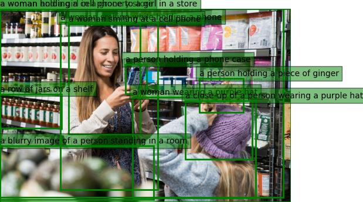
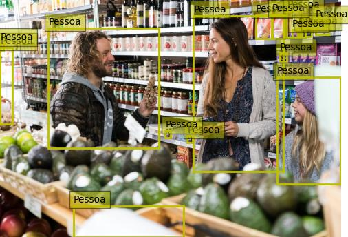

---
# Azure Vision Image Analysis

Este script Python exemplifica a utilização do serviço Azure Vision para analisar, rotular e identificar elementos visuais nas imagens em uma pasta de entrada e salvar os resultados em uma pasta de saída.

⚠️ **Atenção**: Ao final dos seus testes não  se esqueça de apagar os recursos ⚠️

[🧹Não sabe como apagar? 👉 Veja aqui](https://learn.microsoft.com/pt-pt/azure/ai-services/multi-service-resource?pivots=azportal&tabs=windows#clean-up-resources)

## 🔗 Links de Referência

[📝Documentação Azure AI Vision](https://learn.microsoft.com/en-us/azure/ai-services/computer-vision/)

[🌐 API 4.0](https://eastus.dev.cognitive.microsoft.com/docs/services/Cognitive_Services_Unified_Vision_API_2024-02-01/operations/61d65934cd35050c20f73ab6)

[😺 Repositorio GIT azure-sdk-for-python com exemplos](https://github.com/Azure/azure-sdk-for-net/tree/main/sdk/vision/Azure.AI.Vision.ImageAnalysis/samples)


## Índice

1. [Requisitos](#requisitos)
2. [Instalação e Configuração](#instalação-e-configuração)
3. [Como Usar](#como-usar)
4. [Funcionalidades](#funcionalidades)
5. [Exemplos de Imagens](#exemplos-de-imagens)
6. [Licença](#licença)


## Requisitos

- Python 3.x
- Conta no Azure com o serviço Vision habilitado  [Não tem? 👉 Crie aqui sua conta Gratuita](https://azure.microsoft.com/pt-pt/free/)
- Chave de API (chave primária ou secundária)[Não tem? 👉 Veja aqui](https://learn.microsoft.com/pt-pt/azure/ai-services/computer-vision/quickstarts-sdk/image-analysis-client-library-40?tabs=visual-studio%2Cwindows&pivots=programming-language-python)
- Endpoint do serviço Azure Vision [Não tem? 👉 Veja aqui](https://learn.microsoft.com/pt-pt/azure/ai-services/computer-vision/quickstarts-sdk/image-analysis-client-library-40?tabs=visual-studio%2Cwindows&pivots=programming-language-python)


## Instalação e Configuração

1. Configure as variáveis de ambiente com o endpoint e a chave da API do Azure Vision:
   
   Para usuários do Linux:

   ```bash
   export VISION_ENDPOINT=<seu_endpoint>
   export VISION_KEY=<sua_chave>
   ```
   Para usuários do Windows:

   - Abra o menu Iniciar e pesquise por "Variáveis de ambiente".
   - Clique em "Editar variáveis de ambiente do sistema".
   - Na janela de Propriedades do sistema, clique no botão "Variáveis de ambiente".
   - Na seção "Variáveis do sistema", clique em "Novo..." para adicionar uma nova variável.
   - Em "Nome da variável", insira `VISION_ENDPOINT`.
   - Em "Valor da variável", insira o endpoint do Azure Vision.
   - Repita as etapas anteriores para adicionar a chave da API, utilizando `VISION_KEY` como nome da variável e sua chave como valor.
   - Clique em "OK" para fechar todas as janelas de configuração.


⚠️ **Atenção**: Nunca exponha sua key ou endpoint diretamente no código ⚠️

⚠️ **Atenção**: Se estiver com o terminal aberto terá de reiniciá-lo para que entenda as novas variáveis de ambiente ⚠️


2. Clone este repositório para o seu ambiente local:

   ```bash
   git clone https://github.com/megarj/Microsoft-Azure-Vision-Image-Analysis.git
   ```

3. Navegue até o diretório do projeto:

   ```bash
   cd Microsoft-Azure-Vision-Image-Analysis
   ```

4. Crie e ative um ambiente virtual Python:
   
    ### Windows:
    ```bash
    python -m venv escolha-nome-ambiente
    escolha-nome-ambiente\Scripts\activate
    ```
    ### Linux:
    ```bash
    python -m venv escolha-nome-ambiente
    source escolha-nome-ambiente/bin/activate
    ```

Essas instruções criam e ativam um ambiente virtual Python no respectivo sistema operacional. Certifique-se de substituir `escolha-nome-ambiente` pelo nome desejado para o seu ambiente virtual.

5. Instale as dependências necessárias:

   ```bash
   pip install -r requirements.txt
   ```


## Como Usar

Para usar o script, basta colocar as imagens que deseja analisar na pasta `inputs`. O script irá processar automaticamente as imagens e salvar os resultados em formato JSON na pasta `output`. Certifique-se de que as imagens tenham nomes que correspondam aos prefixos necessários para ativar as diferentes funcionalidades de análise.

Execute o script com o seguinte comando:

```bash
python azure_vision_image_analysis.py
```


## Funcionalidades

O script analisa as imagens com base nos prefixos dos nomes dos arquivos. Os prefixos e suas funcionalidades correspondentes são:

```python
 features_map = {
    "analysis": [VisualFeatures.DENSE_CAPTIONS],
    "ocr": [VisualFeatures.READ],
    "people": [VisualFeatures.PEOPLE]
 }
```
Segue a lista completa abaixo para auxiliar no uso das demais funcionalidades

| **Recurso Visual** | **Descrição** |
|-------------------|---------------|
| Caption         | Gera uma frase de legenda legível por humanos que descreva o conteúdo da imagem. |
| DenseCaptions    | Gera frases de legenda legíveis por humanos para até 10 regiões diferentes na imagem, incluindo uma para a imagem inteira. |
| None           | Nenhum recurso visual é selecionado. |
| Objects          | Detecção de objetos. Isso é semelhante às tags, mas focado em detectar objetos físicos na imagem e retornar sua localização. |
| People            | Detecte as pessoas na imagem e retorne sua localização. |
| Read              | Extraia texto impresso ou manuscrito da imagem. Também conhecido como Reconhecimento Óptico de Caracteres (OCR). |
| SmartCrops        | Encontre sub-regiões representativas da imagem para geração de miniaturas, nas proporções desejadas, com prioridade para as faces detectadas. |
| Tags              | Extraia tags de conteúdo para milhares de objetos reconhecíveis, seres vivos, cenários e ações que aparecem na imagem. |

[Dados tirados da documentação da API de Análise de Imagens 4.0](https://learn.microsoft.com/pt-br/dotnet/api/azure.ai.vision.imageanalysis.visualfeatures?view=azure-dotnet-preview)


## Exemplos de Imagens

> Certifique-se de que as imagens na pasta `inputs` tenham nomes que correspondam aos prefixos mencionados acima para ativar as funcionalidades desejadas de análise.

| analysis_store-camera-1.jpg | ocr_advert.jpg | people_store-camera-2.jpg |
|---|---|---|
| |  |  |
| |  |  |


## Licença

Este projeto está licenciado sob a [Licença MIT](LICENSE).

---

Gostou, achou útil? Considere dar uma estrela 😉

[](https://github.com/megarj/Microsoft-Azure-Vision-Image-Analysis)
